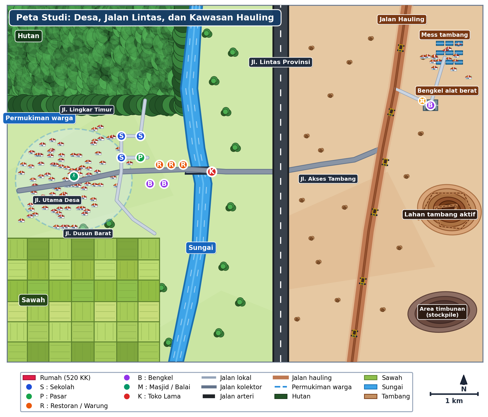
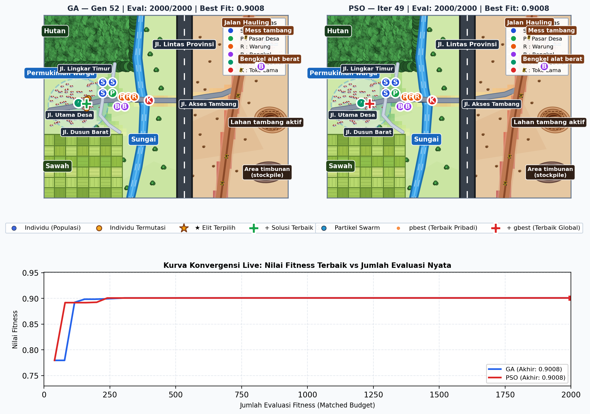
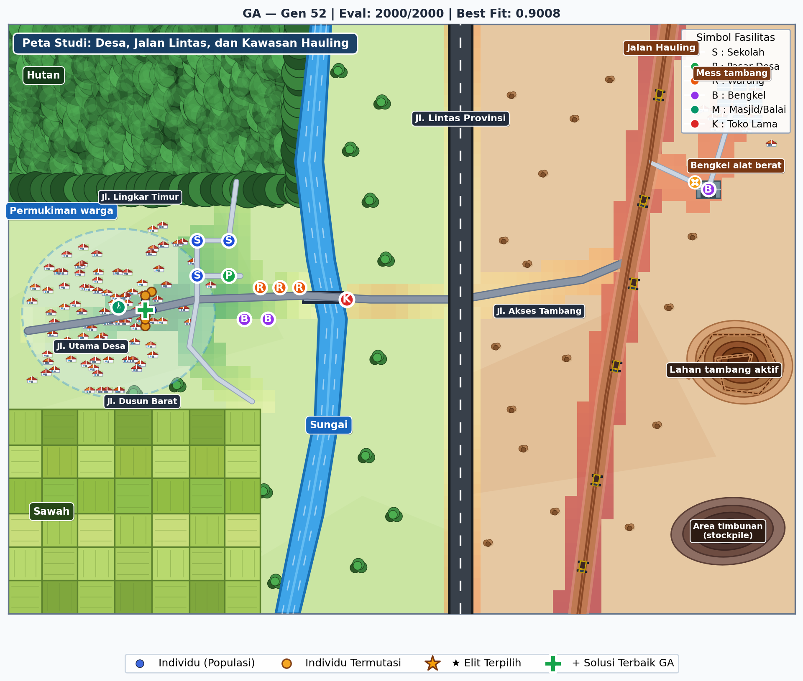
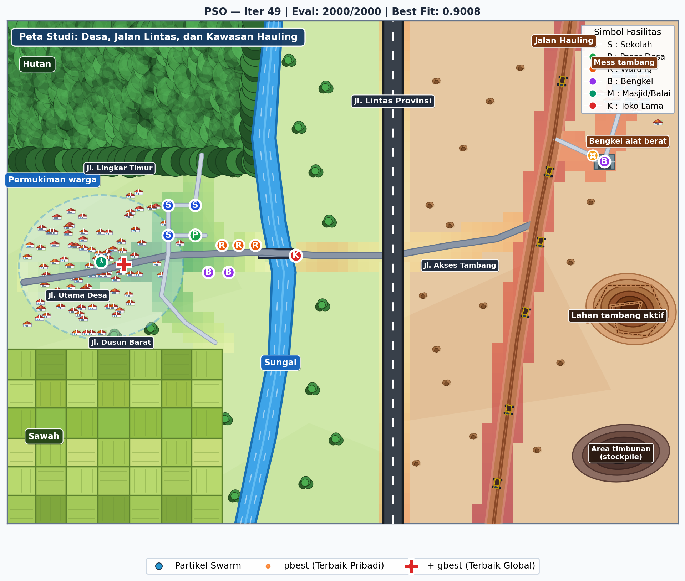
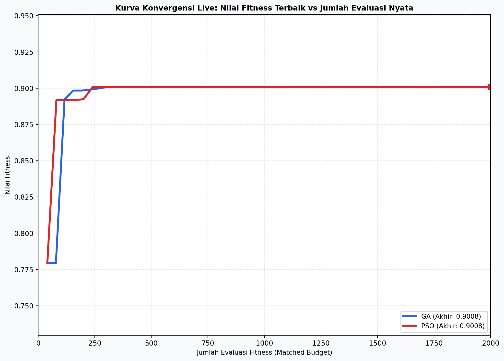
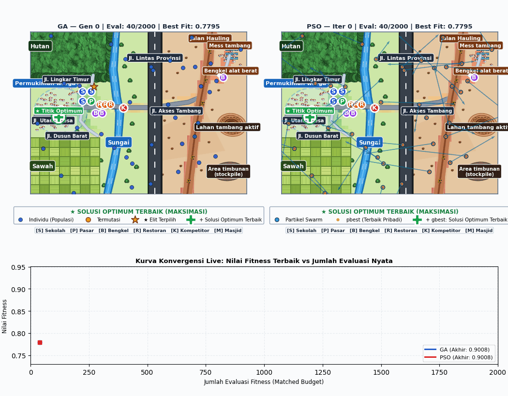
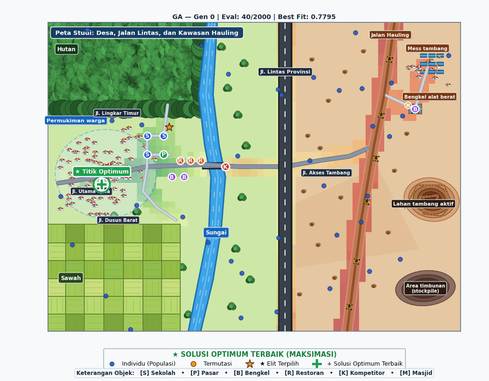
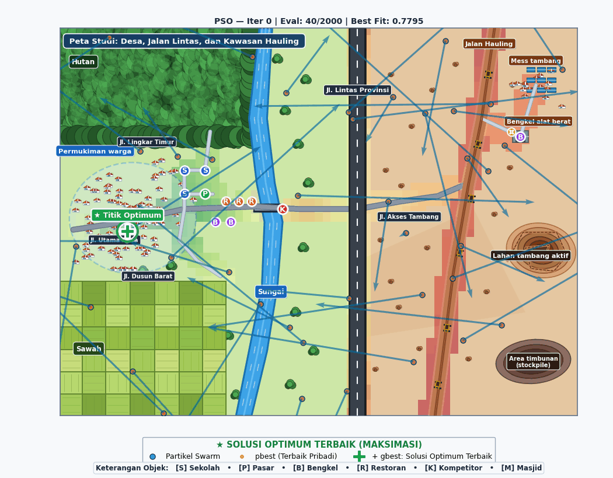
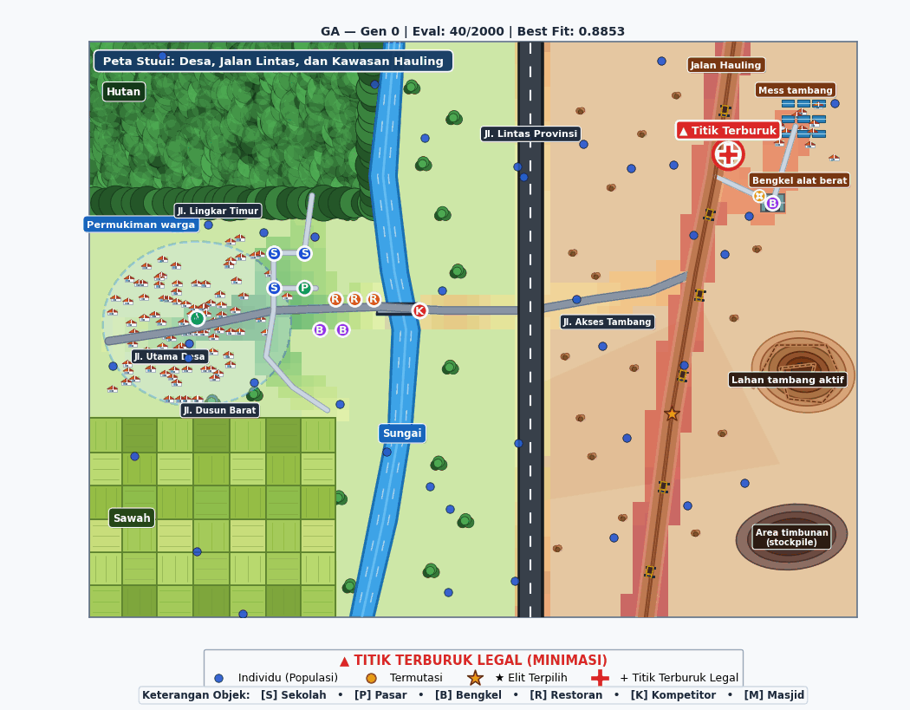
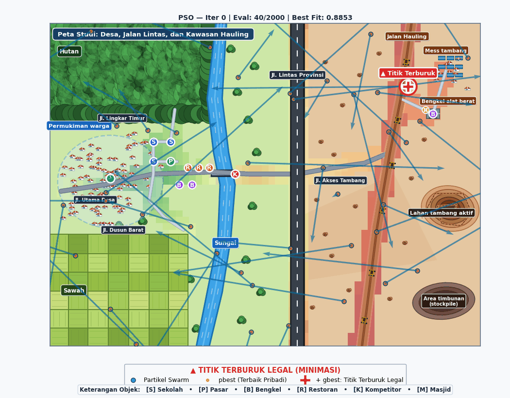

# Optimasi Penentuan Lokasi Fasilitas Koperasi Desa (KOPDES) Sukamaju Mandiri
### Perbandingan Algoritma Genetika (GA) dan Particle Swarm Optimization (PSO) Berbasis Data Lapangan Spasial

Proyek komputasi evolusioner ini memodelkan dan menyelesaikan permasalahan nyata **Facility Location Problem (FLP)**: menentukan koordinat lokasi pembangunan gedung terpadu **Koperasi Desa (KOPDES) Sukamaju Mandiri** di dalam 1 wilayah desa seluas **300 Hektar (2.0 km × 1.5 km = 2.000 m × 1.500 m)**. 

Implementasi **Real-Coded Genetic Algorithm (GA)** dan **Continuous Particle Swarm Optimization (PSO)** ditulis **murni dari nol (*from scratch*)** menggunakan pustaka saintifik Python (**NumPy, SciPy, Pandas, Matplotlib, Tkinter, Pytest**) tanpa bergantung pada pustaka optimasi siap pakai (seperti DEAP atau PySwarms). Hal ini memastikan setiap operator matematis, seleksi, rekombinasi, pergerakan partikel, dan penanganan batasan spasial dapat dipertanggungjawabkan secara transparan dan terverifikasi secara ilmiah.

---

## 1. Peta Tata Ruang Wilayah Desa Sukamaju

Wilayah studi memodelkan 1 desa lengkap dengan dinamika heterogen yang mencakup sentra permukiman warga, persawahan irigasi teknis, jaringan jalan berbagai kelas perkerasan, fasilitas publik, dan kawasan lindung:


*Gambar 1: Peta Tata Ruang Wilayah Desa Sukamaju (2.0 km × 1.5 km) yang dirender langsung pada kanvas grafis Tkinter.*

### Karakteristik Spasial Wilayah Desa:
1. **Permukiman Warga Desa (520 KK)**: Tersebar pada 50 klaster perumahan di sisi barat dengan populasi 4 hingga 18 KK per klaster.
2. **Kondisi Jaringan Jalan**:
   - **Jalan Arteri / Lintas Provinsi** (Lebar 17.5 pt, aspal hotmix mulus dua arah, kapasitas truk besar, mutu $K = 1.00$).
   - **Jalan Kolektor / Jalan Utama Desa** (Lebar 11.0 pt, aspal kokoh dilewati seluruh warga dan truk logistik pupuk, mutu $K = 0.85$).
   - **Jalan Lokal Lingkungan** (Lebar 6.0 pt, paving block sempit antar dusun, mutu $K = 0.60$).
   - **Jalan Hauling / Tanah Lumpur** (Lebar 5.0 pt, jalan tanah merah di timur yang becek dan licin saat hujan, mutu $K = 0.20$).
3. **Fasilitas Publik Eksisting**: Pasar Desa ($\beta = 2.0$), SDN Sukamaju 1 ($\beta = 1.5$), Warung Makan ($\beta = 1.2$), Bengkel Motor ($\beta = 0.8$), dan Masjid Jami'/Balai Desa ($\beta = 1.0$).
4. **Warung Kelontong Warga Lama (Kompetitor K)**: Terletak di koordinat $(X = 860\text{ m}, Y = 800\text{ m})$ dekat jembatan desa.
5. **Zona Terlarang Dilindungi (Dilarang Membangun Fisik)**:
   - Poligon Sawah Irigasi Produktif (dilindungi Perda LP2B).
   - Poligon Sempadan Sungai Sukamaju (rawan banjir bandang & erosi tebing).
   - Poligon Hutan Lindung Adat (konservasi tangkapan air utara).
   - Poligon Galian Tambang C (area berbahaya operasional alat berat).

---

## 2. Antarmuka Simulasi Interaktif GUI Desktop (Tkinter)

Seluruh dinamika pencarian solusi metaheuristik dijalankan secara visual dan interaktif melalui aplikasi desktop berbasis **Tkinter** ([`app_tkinter.py`](app_tkinter.py)):


*Gambar 2: Antarmuka Simulasi Interaktif Tkinter Mode Berdampingan (Split View): Sebaran Individu GA (Kiri), Pergerakan Partikel PSO (Kanan), dan Kurva Konvergensi Live Real-Time (Bawah).*

### Fitur-Fitur Utama GUI Tkinter:
- **Tampilan Split-Screen & Layar Penuh**: Mendukung mode split berdampingan (GA vs PSO bersamaan), layar penuh GA, layar penuh PSO, atau layar penuh kurva konvergensi.
- **Kontrol Playback Real-Time**: Play/Pause, Step (langkah per generasi/iterasi), Reset, Run to End, serta pengaturan delay kecepatan animasi (10 ms – 300 ms).
- **Mode Optimasi Dinamis**: Radio button untuk beralih instan antara **Mode Maksimasi** (mencari lokasi KOPDES terbaik) dan **Mode Minimasi Valid** (mencari lokasi terburuk yang tetap legal di tepi jalan).
- **Slider Bobot Kriteria Interaktif**: Pengguna dapat mengubah bobot $w_1$ (Warga), $w_2$ (Jalan), $w_3$ (Fasilitas), dan $w_4$ (Kompetitor) secara bebas, lalu menekan tombol **"🔄 Terapkan Bobot & Hitung Ulang"** untuk melihat simulasi skenario secara live (*What-If Sensitivity Analysis*).
- **Tab Inspeksi Titik (Klik Peta)**: Klik titik manapun pada kanvas peta untuk membedah status legalitas zonasi, jarak koridor jalan, estimasi fitness, dan nilai masing-masing dari 4 fitur.
- **Navigasi Zoom & Pan Mandiri**: Zoom in/out independen untuk subplot GA atau PSO via scroll mouse, tombol toolbar, atau preset fokus wilayah desa.

---

## 3. Formulasi Matematis Fungsi Kebugaran (*Fitness Function*)

Fungsi kebugaran dirumuskan secara aditif berbasis **4 Fitur Kebugaran Berbobot (*Weight Fitting Features*)** yang seluruhnya distandarisasi ke rentang $[0.0, 1.0]$:

$$\max_{\mathbf{x}} \mathcal{F}(\mathbf{x}) = w_1 S_{\text{pop}}(\mathbf{x}) + w_2 S_{\text{road}}(\mathbf{x}) + w_3 S_{\text{fac}}(\mathbf{x}) + w_4 S_{\text{comp}}(\mathbf{x}) - \text{Penalti}(\mathbf{x})$$

Dengan total bobot ternormalisasi:
$$\sum_{k=1}^4 w_k = w_1 + w_2 + w_3 + w_4 = 0.35 + 0.25 + 0.20 + 0.20 = \mathbf{1.00} \quad (\mathbf{100\%})$$

### Rincian Formulasi Ke-4 Fitur:

#### 1. Kepadatan Pemukiman Warga Desa ($S_{\text{pop}}$, Bobot $w_1 = 0.35$)
Mengukur kemudahan akses bagi 520 kepala keluarga (KK) warga desa di 50 klaster rumah melalui peluruhan eksponensial Gaussian:
$$S_{\text{pop}}(\mathbf{x}) = \operatorname{clip}\left( \frac{1}{M_{\text{pop}}} \sum_{i=1}^{50} h_i \cdot \exp\left( - \frac{\|\mathbf{x} - \mathbf{h}_i\|^2}{2 \sigma_{\text{pop}}^2} \right), 0.0, 1.0 \right)$$
- $\mathbf{h}_i$: koordinat klaster rumah warga ke-$i$.
- $h_i$: bobot jumlah KK ($4 \sim 18$ KK, total 520 KK).
- $\sigma_{\text{pop}} = 250.0\text{ meter}$: radius jalan kaki yang nyaman bagi warga.
- $M_{\text{pop}}$: faktor pembagi normalisasi terkalibrasi otomatis pada pusat massa kepadatan pemukiman.

#### 2. Kondisi & Mutu Jalan Distribusi ($S_{\text{road}}$, Bobot $w_2 = 0.25$)
Menilai kelayakan fisik jalan untuk dilalui armada truk 6 roda pengangkut pupuk bersubsidi dan pickup sembako:
$$S_{\text{road}}(\mathbf{x}) = K_{\text{class}}(\mathbf{x}) \cdot \exp\left( - \frac{d_{\text{road}}(\mathbf{x})^2}{2 \sigma_{\text{road}}^2} \right)$$
- $d_{\text{road}}(\mathbf{x})$: jarak ortogonal terpendek ke garis sumbu jalan terdekat ($\sigma_{\text{road}} = 150.0\text{ m}$).
- $K_{\text{class}}(\mathbf{x})$: koefisien mutu jalan:
  $$K_{\text{class}} = \begin{cases} 
  1.00, & \text{Jalan Arteri / Lintas Provinsi (Aspal hotmix tebal dua arah)} \\ 
  0.85, & \text{Jalan Kolektor / Jalan Utama Desa (Aspal mulus kokoh untuk truk pupuk)} \\ 
  0.60, & \text{Jalan Lokal Dusun (Paving block / aspal sempit)} \\ 
  0.20, & \text{Jalan Hauling / Tanah Lumpur (Licin, becek berlumpur saat hujan, diskon 80\%)} 
  \end{cases}$$

#### 3. Sinergi Fasilitas Umum Desa ($S_{\text{fac}}$, Bobot $w_3 = 0.20$)
Menghitung daya tarik keramaian dari fasilitas publik desa eksisting (*trip-chaining*):
$$S_{\text{fac}}(\mathbf{x}) = \operatorname{clip}\left( \frac{1}{M_{\text{fac}}} \sum_{k \in \mathcal{K}} \beta_k \sum_{j=1}^{M_k} f_{k,j} \cdot \exp\left( - \frac{\|\mathbf{x} - \mathbf{p}_{k,j}\|^2}{2 \sigma_{\text{fac}}^2} \right), 0.0, 1.0 \right)$$
- $\beta_{\text{pasar}} = 2.0$ (Pasar Desa: magnet ekonomi harian terbesar).
- $\beta_{\text{sekolah}} = 1.5$ (SDN Sukamaju 1: titik kumpul pagi hari orang tua murid).
- $\beta_{\text{warung}} = 1.2$, $\beta_{\text{masjid/kantor}} = 1.0$, $\beta_{\text{bengkel}} = 0.8$.
- $\sigma_{\text{fac}} = 200.0\text{ meter}$.

#### 4. Jarak Aman Toko Kelontong Warga Lama ($S_{\text{comp}}$, Bobot $w_4 = 0.20$)
Menjaga jarak ideal dari warung kelontong warga lama (Toko K di $X=860, Y=800$) menggunakan kurva non-monotonik Ricker:
$$S_{\text{comp}}(\mathbf{x}) = \begin{cases} 
S_{\text{base}}(R) \cdot \left( \dfrac{d_c(\mathbf{x})}{180.0} \right)^{1.8}, & \text{jika } d_c(\mathbf{x}) < 180.0\text{ meter} \\ 
S_{\text{base}}(R), & \text{jika } d_c(\mathbf{x}) \ge 180.0\text{ meter} 
\end{cases}$$
Di mana $R = \frac{d_c}{d_{\text{opt}}}$ dengan $d_{\text{opt}} = 350.0\text{ meter}$ dan $S_{\text{base}}(R) = R^{1.6} \cdot \exp(1.0 - R^{1.6})$. Jarak optimal $350\text{ m}$ menghasilkan skor $1.00$, sedangkan jarak $< 180\text{ m}$ dipotong penalti kanibalisasi agar tidak mematikan usaha warga.

---

### Penanganan Batasan (*Constraints*) & Mode Minimasi:

1. **Penalti Batasan Spasial & Koridor Jalan**:
   $$\mathcal{F}_{\text{final}}(\mathbf{x}) = \begin{cases} 
   -1000.0, & \text{jika melanggar batas desa } (0 \le x \le 2000, 0 \le y \le 1500) \text{ atau masuk zona terlarang} \\ 
   -10.0 - \dfrac{d_{\text{road}}(\mathbf{x}) - 50.0}{50.0}, & \text{jika } d_{\text{road}}(\mathbf{x}) > 50.0\text{ m (di luar koridor akses jalan)} \\ 
   \mathcal{F}(\mathbf{x}), & \text{jika seluruh batasan terpenuhi (Solusi Feasible, } \mathcal{F} \in [0, 1]) 
   \end{cases}$$
   Deteksi zona poligon terlarang dilakukan secara eksak menggunakan algoritma **Ray-Casting Vectorized NumPy**.

2. **Mode Maksimum vs Mode Minimum (`min_valid`)**:
   - **Mode Maksimum (`mode="max"`)**: $\mathcal{F} = \text{avg\_score}$ (Mencari lokasi KOPDES terbaik).
   - **Mode Minimum (`mode="min_valid"`)**: $\mathcal{F} = \mathbf{1.0 - \text{avg\_score}}$ (Mencari lokasi terburuk yang tetap legal di pinggir jalan desa). Penalti batas $-1000.0$ tetap aktif sehingga algoritma tidak akan memilih sawah irigasi atau hutan.

---

## 4. Algoritma Optimasi (Ditulis dari Nol)

### Genetic Algorithm (GA) — [`ga.py`](ga.py)
- **Representasi**: Kromosom riil $\mathbf{C} = [x, y]$.
- **Seleksi**: *Tournament Selection* ($k = 3$).
- **Crossover**: *BLX-$\alpha$ (Blend Crossover)* dengan $\alpha = 0.5$ ($P_c = 0.85$):
  $$c_d \sim \mathcal{U}\left(c_{\min} - \alpha \cdot I, \; c_{\max} + \alpha \cdot I\right), \quad I = c_{\max} - c_{\min}$$
- **Mutasi**: *Adaptive Gaussian Mutation* ($\sigma_{\text{mut}} = 40.0\text{ m}$, $P_m = 0.15$ per gen).
- **Elitisme**: $2$ individu terbaik dipertahankan tanpa mutasi ke generasi berikutnya.

### Particle Swarm Optimization (PSO) — [`pso.py`](pso.py)
- **Representasi**: Partikel dengan posisi $\mathbf{x}_i \in \mathbb{R}^2$ dan kecepatan $\mathbf{v}_i \in [-v_{\max}, v_{\max}]$.
- **Pembaruan Kecepatan & Posisi**:
  $$\mathbf{v}_i^{t+1} = w^t \cdot \mathbf{v}_i^t + c_1 r_1 (\mathbf{p}_{\text{best}, i} - \mathbf{x}_i^t) + c_2 r_2 (\mathbf{g}_{\text{best}} - \mathbf{x}_i^t)$$
  $$\mathbf{x}_i^{t+1} = \mathbf{x}_i^t + \mathbf{v}_i^{t+1}$$
- **Inersia Adaptif (Linear Decay)**: $w(t) = 0.9 \to 0.4$, $c_1 = 1.494$ (kognitif), $c_2 = 1.494$ (sosial).
- **Penanganan Batas**: *Boundary Reflection* (kecepatan dibalik dan posisi dipantulkan ke dalam wilayah).

---

## 5. Hasil Komputasi dan Visualisasi Simulasi

Kedua algoritma diuji dengan protokol **Matched Budget** tepat **2.000 kali evaluasi fungsi fitness** per pengujian.

### Visualisasi Hasil Layar Penuh pada Kanvas Tkinter:

#### A. Algoritma Genetika (GA) Layar Penuh

*Gambar 3: Tampilan Layar Penuh GA pada Kanvas Tkinter: Sebaran Populasi Kromosom, Mutasi, dan Rekomendasi Titik KOPDES.*

#### B. Particle Swarm Optimization (PSO) Layar Penuh

*Gambar 4: Tampilan Layar Penuh PSO pada Kanvas Tkinter: Partikel Swarm, Posisi pbest, dan Posisi Optimal Global gbest KOPDES.*

#### C. Grafik Konvergensi Live Real-Time

*Gambar 5: Kurva Konvergensi Live Matched Budget 2.000 Evaluasi GA vs PSO pada Kanvas Tkinter.*

---

### Animasi GIF Dinamika Optimasi (Mode Maksimasi & Mode Minimasi)

Berikut adalah animasi GIF proses pencarian solusi langkah demi langkah (53 generasi/iterasi):

#### 1. Mode Maksimasi (Mencari Lokasi Terbaik KOPDES — Titik di Jalan Utama Desa)
- **Simulasi Split-Screen Maksimasi (GA + PSO + Konvergensi)**:
  
- **Evolusi Algoritma Genetika (GA Maksimasi)**:
  
- **Pergerakan Kawanan Partikel (PSO Maksimasi)**:
  

#### 2. Mode Minimasi Valid (Mencari Lokasi Terburuk Sah — Titik di Jalan Tanah Hauling)
- **Simulasi Split-Screen Minimasi (GA + PSO + Konvergensi)**:
  
- **Evolusi Algoritma Genetika (GA Minimasi)**:
  
- **Pergerakan Kawanan Partikel (PSO Minimasi)**:
  

---

### Tabel Perbandingan Kinerja (30 Run Independen):

| Metrik Evaluasi | Genetic Algorithm (GA) | Particle Swarm Optimization (PSO) | Evaluasi Ilmiah |
|---|---|---|---|
| **Nilai Fitness Terbaik (Max)** | **0.785148** | **0.785148** | Identik hingga 6 angka desimal |
| **Nilai Fitness Rata-rata (Mean)** | 0.782871 | **0.785148** | PSO lebih konsisten dan seragam |
| **Median Fitness** | **0.785148** | **0.785148** | Identik sempurna |
| **Standar Deviasi (Std)** | 0.012471 | **0.000000** ($4.39 \times 10^{-10}$) | PSO memiliki stabilitas sempurna |
| **Interquartile Range (IQR)** | $1.02 \times 10^{-10}$ | **$8.69 \times 10^{-11}$** | Variasi kuartil sangat rapat |
| **Persentase Solusi Layak** | **100.0% (30/30)** | **100.0% (30/30)** | Keduanya 100% patuh batasan desa |
| **Rata-rata Waktu Eksekusi** | 1.897 ± 0.917 s | **0.624 ± 0.096 s** | **PSO 3.0× lebih cepat** |
| **Titik Rekomendasi KOPDES** | **$(X = 295.4\text{ m}, Y = 753.8\text{ m})$** | **$(X = 295.4\text{ m}, Y = 753.8\text{ m})$** | **Konvergen ke titik fisik yang sama** |

### Uji Hipotesis Statistik Mann-Whitney U:
- Nilai $U = 654.00$, $p\text{-value} = 0.00261 < 0.05$ (**Signifikan secara statistik**).
- Rank-Biserial Correlation $r = -0.453$.
- **Kesimpulan**: PSO terbukti secara statistik signifikan lebih stabil dan efisien dalam komputasi continuous FLP, sementara GA memiliki keunggulan eksplorasi yang tangguh.

---

## 6. Struktur Direktori Proyek

```text
biocomputing-7/
├── config.json                     # Konfigurasi bobot fitness, parameter GA, PSO, dan batasan
├── requirements.txt                # Dependensi pustaka Python
├── map_model.py                    # Model peta spasial, parsing JSON, ray-casting geometri, styling peta
├── fitness.py                      # Evaluator multi-kriteria, counter evaluasi, mode max/min_valid
├── ga.py                           # Real-coded GA from scratch (Tournament, BLX-alpha, Gaussian, Elitism)
├── pso.py                          # Continuous PSO from scratch (Inertia decay, cognitive, social, reflect)
├── app_tkinter.py                  # Aplikasi simulasi interaktif GUI Desktop (Tkinter + Matplotlib Canvas)
├── run_batch.py                    # Runner eksperimen 30 run independen matched budget
├── analyze.py                      # Analisis statistik batch, uji Mann-Whitney U, dan plotting
├── stats_utils.py                  # Helper kalkulasi statistik deskriptif & non-parametrik
├── generate_maps.py                # Generator preset peta wilayah desa
├── build_docx_report.py            # Generator otomatis berkas laporan formal Word (.docx)
├── export_optimization_gifs.py     # Script generator 6 animasi GIF (Maksimasi & Minimasi)
├── LAPORAN_OPTIMASI_GA_PSO.md      # Laporan akademik lengkap format Markdown
├── LAPORAN_OPTIMASI_GA_PSO_REVISI.docx # Laporan akademik formal Word lengkap dengan gambar & tabel
├── test_facility.py                # Unit test (Pytest) untuk evaluasi, counter, dan batasan geometri
├── maps/                           # Direktori berkas peta spasial JSON
│   ├── peta_studi.json
│   ├── desa_ramai.json
│   ├── hauling.json
│   └── campuran.json
└── results/                        # Direktori output visualisasi, GIF animasi, & data statistik
    ├── map_study_area.png
    ├── tkinter_simulasi_split.png
    ├── tkinter_simulasi_ga_full.png
    ├── tkinter_simulasi_pso_full.png
    ├── tkinter_simulasi_conv_full.png
    ├── ga_maksimasi.gif            # Animasi evolusi GA (lokasi terbaik)
    ├── pso_maksimasi.gif           # Animasi swarm PSO (lokasi terbaik)
    ├── simulasi_maksimasi_split.gif# Animasi split view maksimasi (GA + PSO + konvergensi)
    ├── ga_minimasi.gif             # Animasi evolusi GA (lokasi terburuk sah)
    ├── pso_minimasi.gif            # Animasi swarm PSO (lokasi terburuk sah)
    ├── simulasi_minimasi_split.gif # Animasi split view minimasi (GA + PSO + konvergensi)
    ├── raw_runs.csv
    ├── summary_statistics.csv
    └── statistical_test_report.txt
```

---

## 7. Panduan Menjalankan Program

### 1. Instalasi Dependensi
Pastikan Python 3.9+ telah terpasang, lalu instal dependensi pustaka:
```bash
pip install -r requirements.txt
```

### 2. Menjalankan Simulasi Interaktif Tkinter (GUI Desktop)
Untuk mendemonstrasikan visualisasi animasi GA vs PSO, inspeksi titik, dan pengujian slider bobot:
```bash
python app_tkinter.py
```

### 3. Menjalankan Pengujian Unit Otomatis (Pytest)
Memvalidasi fungsionalitas counter matched budget, penalti zona terlarang, kurva Ricker, dan operator genetika:
```bash
pytest -v test_facility.py
```

### 4. Menjalankan Eksperimen Batch 30 Run
Menjalankan pengujian stokastik 30 run independen dengan matched budget 2.000 evaluasi:
```bash
python run_batch.py --runs 30 --budget 2000 --mode both
```

### 5. Melakukan Analisis Statistik Ilmiah
Menghitung statistik deskriptif dan menjalankan uji hipotesis Mann-Whitney U:
```bash
python analyze.py
```

### 6. Membangun Berkas Dokumen Word Laporan (.docx)
Untuk menghasilkan berkas dokumen laporan resmi lengkap dengan gambar resolusi tinggi, tabel terformat, dan lampiran:
```bash
python build_docx_report.py
```
Hasil berkas Word tersimpan di: [`LAPORAN_OPTIMASI_GA_PSO_REVISI.docx`](LAPORAN_OPTIMASI_GA_PSO_REVISI.docx).

---

## 8. Lisensi & Tim Penyusun
Proyek ini disusun untuk memenuhi Tugas Besar Mata Kuliah **Komputasi Evolusioner / Biocomputing & Optimasi Sistem** dengan studi kasus penataan tata ruang Koperasi Desa (KOPDES) Sukamaju Mandiri.
